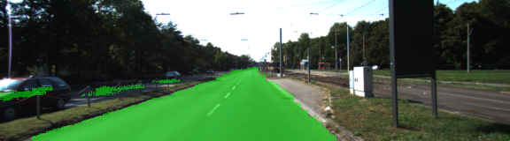
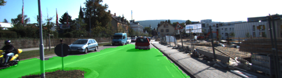
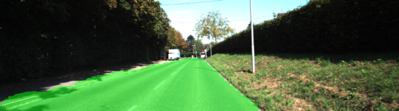
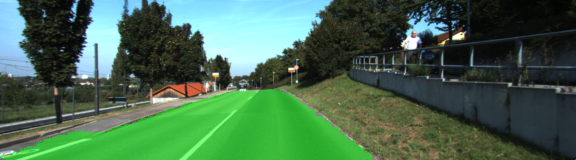
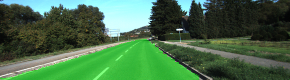
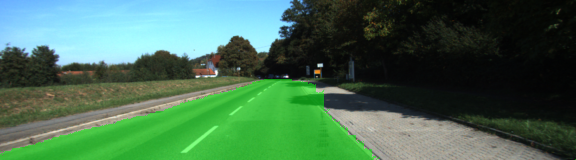
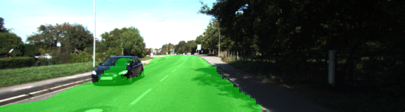
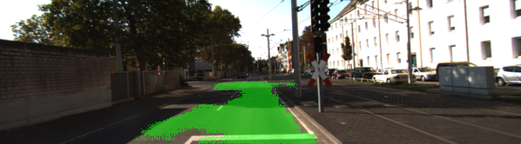
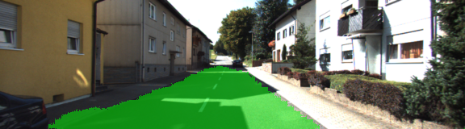
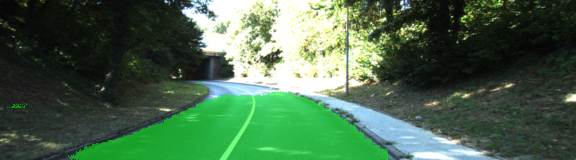

### CarND-Semantic-Segmentation: Advanced Deep Learning Project

# Project goal: 
Build a Fully Convolutional Network(FCN) to identify the road in picture. The training data is from kitti.

# Solution:
FCN encoder is reuse the VGG16 Nerual network and remove the last fully connected layer. Instead, replace
it with the 1x1 convolutional network.
upsample the 1x1 to increase the image resolutions.
VGG3 and VGG4 layer are used as skip layer to connect to the upsampled layer to keep the spacial information.

# Training Parameters:

epoch = 50

batch size = 10

learning rate = 0.002

drop prob = 0.7

# training loss
  use the cross entropy for logits and predict value. use the AdamOptimizer to optimize the loss.

# some sample images after clasification:

